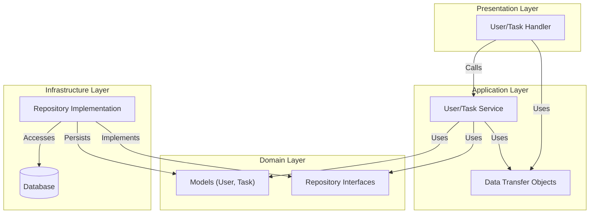

# DDDにおけるuber-fxによるDIの活用

「DDDにおけるuber-fxによるDIの活用」記事のサンプルコードを置く場所です。

## ディレクトリ構造

このプロジェクトは、ドメイン駆動設計（DDD）とクリーンアーキテクチャの原則に基づいたディレクトリ構成を採用しています。

- `internal/domain`
  ドメイン層。ビジネスロジックの核となるエンティティ（User, Task）や値オブジェクト、およびリポジトリのインターフェース定義を含みます。他の層への依存を持ちません。

- `internal/application`
  アプリケーション層。ドメイン層のモデルやリポジトリを利用して、具体的なユースケース（ユーザー登録、タスク追加など）を実現するサービス（Service）と、データの転送オブジェクト（DTO）を含みます。

- `internal/infrastructure`
  インフラストラクチャ層。ドメイン層で定義されたリポジトリの実装（インメモリDBなど）やロガーなどの技術的詳細を提供します。

- `internal/presentation`
  プレゼンテーション層。Echoを使用したHTTPサーバーとハンドラーを含みます。クライアントからのリクエストを受け取り、アプリケーションサービスを呼び出します。

## アーキテクチャ

各層の依存関係は、中心にあるドメイン層に向かって依存するように設計されています（依存性逆転の原則）。
`uber-fx` を使用して、アプリケーション起動時に各層の依存関係（リポジトリの実装をサービスに注入するなど）を解決しています。

