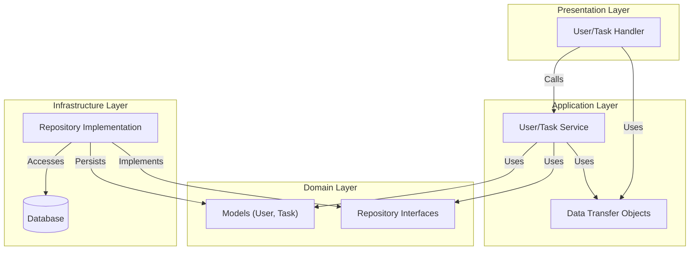

# DDDにおけるuber-fxによるDIの活用

「DDDにおけるuber-fxによるDIの活用」記事のサンプルコードを置く場所です。

## ディレクトリ構造

このプロジェクトは、ドメイン駆動設計（DDD）とクリーンアーキテクチャの原則に基づいたディレクトリ構成を採用しています。

- `internal/domain`
  ドメイン層。ビジネスロジックの核となるエンティティ（User, Task）や値オブジェクト、およびリポジトリのインターフェース定義を含みます。他の層への依存を持ちません。

- `internal/application`
  アプリケーション層。ドメイン層のモデルやリポジトリを利用して、具体的なユースケース（ユーザー登録、タスク追加など）を実現するサービス（Service）と、データの転送オブジェクト（DTO）を含みます。

- `internal/infrastructure`
  インフラストラクチャ層。ドメイン層で定義されたリポジトリの実装（インメモリDBなど）やロガーなどの技術的詳細を提供します。

- `internal/presentation`
  プレゼンテーション層。Echoを使用したHTTPサーバーとハンドラーを含みます。クライアントからのリクエストを受け取り、アプリケーションサービスを呼び出します。

## アーキテクチャ

各層の依存関係は、中心にあるドメイン層に向かって依存するように設計されています（依存性逆転の原則）。
`uber-fx` を使用して、アプリケーション起動時に各層の依存関係（リポジトリの実装をサービスに注入するなど）を解決しています。



## 実行方法

### 必要な環境

- Go 1.25.5以上
- [mise](https://mise.jdx.dev/)（推奨、バージョン管理用）

### セットアップ

初回セットアップ時は、以下のコマンドで依存関係をインストールします：

```bash
make install
```

または、手動で実行する場合：

```bash
mise install  # miseを使用している場合
go mod tidy
```

### サーバーの起動

サーバーを起動するには、以下のいずれかのコマンドを実行します：

```bash
make run
```

または、直接Goコマンドで実行：

```bash
go run ./cmd/server/main.go
```

サーバーはデフォルトで `http://localhost:8080` で起動します。

### その他のコマンド

- **テストの実行**: `make test`
- **コードフォーマット**: `make fmt`
- **リント**: `make lint`
- **モック生成**: `make generate-mocks`
- **ヘルプ表示**: `make help`
